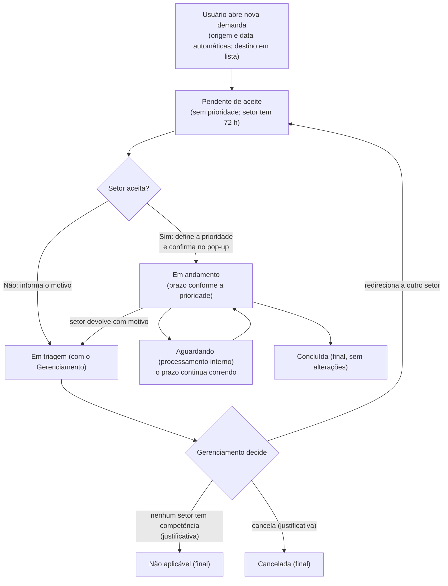
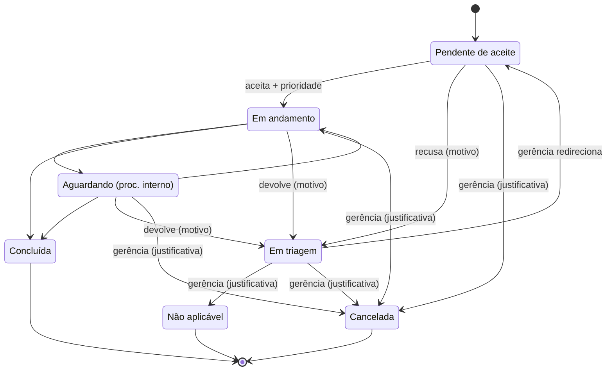
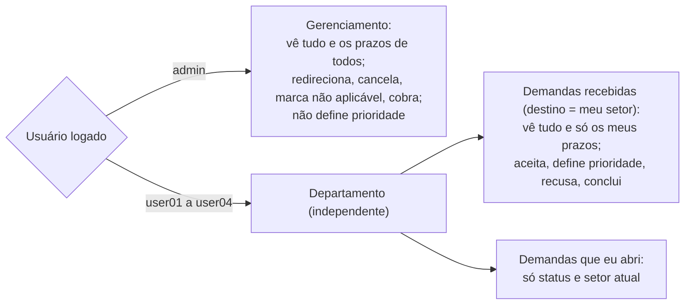
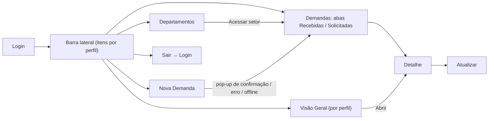
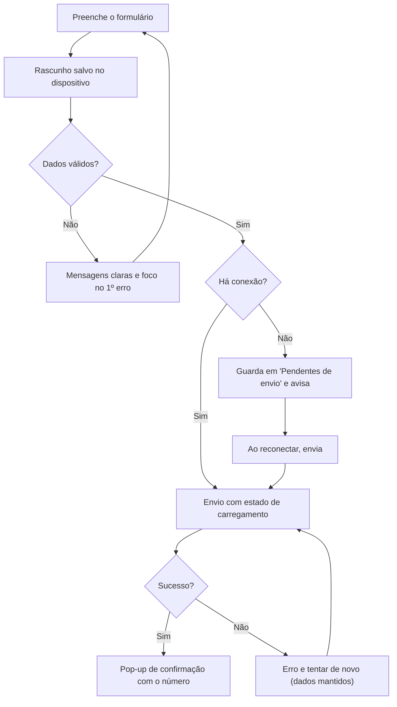

# Fluxos e máquina de estados

> Kit final de 03/10/2026. Fontes: documento técnico de 15/09, Atas 15/09, 22/09 e 29/09, chat de 02/10 e decisões de 03/10 (`docs/REQUISITOS_REGRAS_DE_NEGOCIO.md`). Itens de 03/10 são **propostas** a registrar em ata. Os diagramas usam Mermaid (renderizam no GitHub; **não foram renderizados por quem escreveu**, conferir ao subir).

## 1. Fluxo da demanda

O gerenciamento **não** define prioridade e o setor **nunca** envia direto a outro setor.

## 2. Máquina de estados

## 3. Quem vê o quê

## 4. Navegação

Sem login, qualquer rota vai ao Login. Demanda sem permissão ou inexistente mostra a mesma mensagem.

## 5. Fluxo de envio (Ata 15/09, chat 02/10)

