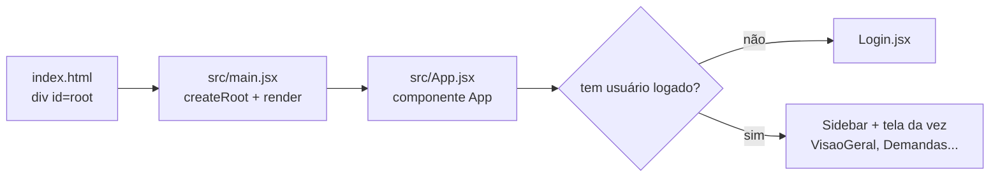

# 11 — React do zero (conceitos básicos)

> Leia com o projeto aberto. Os números de linha são **aproximados** (conferidos em 04/10/2026); procure pelo trecho citado.

## 1. As peças
- **React:** uma biblioteca JavaScript para montar telas. Em vez de mexer na página "na mão", você descreve **como a tela deve ficar** a partir dos dados, e o React atualiza a página quando os dados mudam. *Analogia:* uma planilha. Você muda um número e os totais se recalculam sozinhos.
- **Vite:** a ferramenta que roda o projeto no computador (`npm run dev`) e gera a versão final (`npm run build`). *Analogia:* o "forno" que pega a receita (o código) e entrega o prato pronto (a página).
- **JSX:** o jeito de escrever HTML dentro do JavaScript. Parece HTML, mas fica num arquivo `.jsx` e aceita valores entre chaves `{ }`. Exemplo: `<h1>{pageTitle}</h1>` mostra o conteúdo da variável `pageTitle`.

## 2. Como o app começa

1. O navegador abre `index.html`, que tem uma caixa vazia `<div id="root"></div>` e carrega `/src/main.jsx`.
2. `src/main.jsx` importa os CSS e manda o React desenhar o componente `App` dentro de `root`:
   ```jsx
   // src/main.jsx (≈ linha 9)
   createRoot(document.getElementById('root')).render(
     <StrictMode>
       <App />
     </StrictMode>,
   )
   ```
3. `src/App.jsx` decide qual tela mostrar: sem usuário, o `Login`; com usuário, o menu (`Sidebar`) mais a tela pedida no endereço.

## 3. Conceitos, com exemplos reais
### Componente
- **O que é:** uma função que devolve um pedaço de tela (JSX). Tem nome com letra maiúscula. *Analogia:* uma peça de Lego reaproveitável.
- **No projeto:** `function Sidebar({ activeItem, usuario, onSair })` em `src/components/Sidebar.jsx` (≈ linha 75) desenha o menu lateral. `Dialogo` em `src/components/Dialogo.jsx` é o pop-up usado em várias telas.
- **Em 1 frase:** "Cada tela e cada peça repetida é um componente, uma função que devolve o pedaço de tela."

### Props (propriedades)
- **O que é:** os dados que um componente recebe de quem o usa, como os parâmetros de uma função. *Analogia:* o pedido entregue ao cozinheiro.
- **No projeto:** `App.jsx` desenha `<Sidebar activeItem={...} usuario={usuario} onSair={sair} />`, e a `Sidebar` usa `usuario.nome` e `onSair`. Em `Demandas.jsx` (≈ linha 92), o componente recebe `statusInicial`, `filtroInicial` e `abaInicial`, que vêm do endereço.
- **Em 1 frase:** "Props são os dados que uma tela recebe de quem a chama."

### Estado (`useState`)
- **O que é:** um valor que o componente lembra e que, ao mudar, faz a tela se redesenhar. *Analogia:* o placar de um jogo; mudou o placar, o telão atualiza.
- **No projeto:**
  ```jsx
  // src/pages/Login.jsx (≈ linhas 26-29)
  const [valores, setValores] = useState({ usuario: '', senha: '' })
  const [erros, setErros] = useState({})
  const [avisoReset, setAvisoReset] = useState('')
  const [confirmandoReset, setConfirmandoReset] = useState(false)
  ```
  `valores` guarda o que foi digitado; `setValores` troca o valor e redesenha a tela.
- **Em 1 frase:** "Estado é a memória da tela; quando muda, a tela se atualiza sozinha."

### Efeito (`useEffect`)
- **O que é:** código que roda **depois** de desenhar a tela, para conversar com o "mundo de fora" (endereço, título da aba, eventos do navegador). *Analogia:* depois de servir o prato, avisar o garçom.
- **No projeto:** `App.jsx` (≈ linha 73) escuta a troca de endereço:
  ```jsx
  useEffect(() => {
    function handleHashChange() {
      setHash(window.location.hash)
    }
    window.addEventListener('hashchange', handleHashChange)
    return () => window.removeEventListener('hashchange', handleHashChange)
  }, [])
  ```
  Outros efeitos no mesmo arquivo mandam para `#login` quem não está logado e levam o foco ao título a cada troca de tela.
- **Em 1 frase:** "Efeito é o que a tela faz depois de aparecer, como ouvir a troca de endereço."

### Hook próprio
- **O que é:** "hook" é toda função que começa com `use` e usa recursos do React (`useState`, `useEffect`). Um hook próprio junta uma lógica para reaproveitar em várias telas.
- **No projeto:**
  - `useAvisoLimite` (`src/hooks/useAvisoLimite.js`) cuida do aviso "Limite de N caracteres atingido";
  - `useDemandas` (`src/hooks/useDemandas.js`) lê as demandas e informa "carregando" ou "erro";
  - `useSessao` (`src/hooks/useSessao.js`) guarda o usuário logado.
- **Em 1 frase:** "Hooks próprios são receitas reaproveitáveis; por exemplo, `useDemandas` dá as demandas a qualquer tela."

### Renderização condicional
- **O que é:** mostrar ou não um pedaço da tela conforme uma condição. Em JSX se usa `condição && (...)` ou `condição ? A : B`.
- **No projeto:** em `Login.jsx`, a mensagem de erro só aparece se houver erro:
  ```jsx
  {erros.usuario && (
    <p className="login-field-error" id="usuario-erro">
      {erros.usuario}
    </p>
  )}
  ```
  Em `App.jsx`: `if (!usuario) { return <Login onEntrar={entrar} /> }`.
- **Em 1 frase:** "A tela mostra cada parte só quando faz sentido, como o erro só quando há erro."

### Listas com `map` e `key`
- **O que é:** para desenhar vários itens parecidos, o código percorre uma lista com `.map(...)`. Cada item precisa de uma `key` única, para o React saber quem é quem.
- **No projeto:** `Sidebar.jsx` (≈ linha 84):
  ```jsx
  {navigation.map((item) => (
    <a className={...} href={item.href} key={item.id}> ... </a>
  ))}
  ```
  Em `Demandas.jsx`, cada demanda vira um `<DemandCard … key={demand.id} />`.
- **Em 1 frase:** "Para várias demandas, o código percorre a lista e desenha um card por item, cada um com uma chave única."

### Eventos (`onClick`, `onChange`)
- **O que é:** funções chamadas quando a pessoa clica, digita ou escolhe algo.
- **No projeto:**
  - `Sidebar.jsx` (≈ linha 105): `<button … aria-label="Sair" onClick={onSair}>`;
  - `Login.jsx`: `onChange={atualizar}` guarda cada letra digitada no estado.
- **Em 1 frase:** "Eventos ligam a ação da pessoa (clicar, digitar) a uma função."

## 4. Navegação sem biblioteca de rotas (o "hash")
- **Rota:** o endereço de cada tela. Aqui se usa o **hash**, a parte do endereço depois do `#`, como em `http://localhost:5173/#demandas`. Mudar só o hash não recarrega a página.
- **Quem lê o hash:** `App.jsx`. Ele guarda o endereço no estado `hash` e, a cada `hashchange`, atualiza. A função `getPageFromHash` decide a tela:
  ```jsx
  // src/App.jsx (≈ linha 14)
  function getPageFromHash(hash) {
    if (hash === '#login') return 'login'
    if (hash === '#visao-geral') return 'visao-geral'
    if (hash === '#nova-demanda') return 'nova-demanda'
    if (hash === '#departamentos') return 'departamentos'
    if (hash.startsWith('#demanda/') && hash.endsWith('/editar')) return 'atualizar-demanda'
    if (hash.startsWith('#demanda/')) return 'detalhes-demanda'
    return 'demandas'
  }
  ```
- **Quem troca de tela:**
  - links normais (`<a href="#demandas">` no menu, os cards);
  - código que muda `window.location.hash`, como em `VisaoGeral.jsx` (`abrirNovaDemanda`) e depois de gravar uma ação;
  - `window.location.replace('#login')` quando não há sessão.
- **Partes extras do endereço:**
  - `idDaRota` lê o número em `#demanda/DM-2003`;
  - `setorDaRota` lê o setor em `#demandas/eletrica`;
  - `parametrosDaRota`, `statusDaRota`, `filtroDaRota` e `abaDaRota` leem o que vem depois do `?` (ver o arquivo 15).
- **Em 1 frase:** "O endereço depois do `#` diz qual tela abrir; o `App.jsx` lê e mostra a tela certa."

## 5. Glossário (A–Z)
- **aria-*** (`aria-label`, `aria-describedby`…): atributos que dão informação extra ao leitor de tela.
- **Build:** a versão final, otimizada, gerada por `npm run build`.
- **className:** em JSX, é o `class` do HTML (o nome da classe CSS).
- **Componente:** função que devolve um pedaço de tela.
- **CSS:** a linguagem das cores, tamanhos e posições.
- **Efeito (`useEffect`):** código que roda depois de desenhar a tela.
- **Estado (`useState`):** valor lembrado pela tela; mudou, a tela se redesenha.
- **Evento:** ação da pessoa (clique, digitação) ligada a uma função.
- **Hash:** a parte do endereço depois do `#`; aqui define a tela.
- **Hook:** função cujo nome começa com `use` e que usa recursos do React (ex.: `useState`, `useDemandas`).
- **JSON:** arquivo de dados em texto, com chaves e valores (ex.: `usuarios.json`).
- **JSX:** HTML escrito dentro do JavaScript.
- **key:** identificador único de cada item de uma lista desenhada com `map`.
- **localStorage:** "gaveta" do navegador que guarda texto mesmo depois de fechar; aqui guarda as demandas.
- **map:** percorre uma lista e transforma cada item (aqui, num card).
- **npm:** o programa que instala bibliotecas e roda os comandos do projeto.
- **Props:** dados que um componente recebe.
- **React:** a biblioteca que monta as telas a partir dos dados.
- **Renderizar:** desenhar a tela.
- **Rota:** endereço de uma tela.
- **Seed (semente):** os dados de exemplo que enchem o app na primeira vez (`seed-demandas.json`).
- **sessionStorage:** como o `localStorage`, mas apaga ao fechar a aba; aqui guarda a sessão.
- **Vite:** a ferramenta que roda e empacota o projeto.
- **Vitest:** a ferramenta dos testes automáticos (`npm test`).
