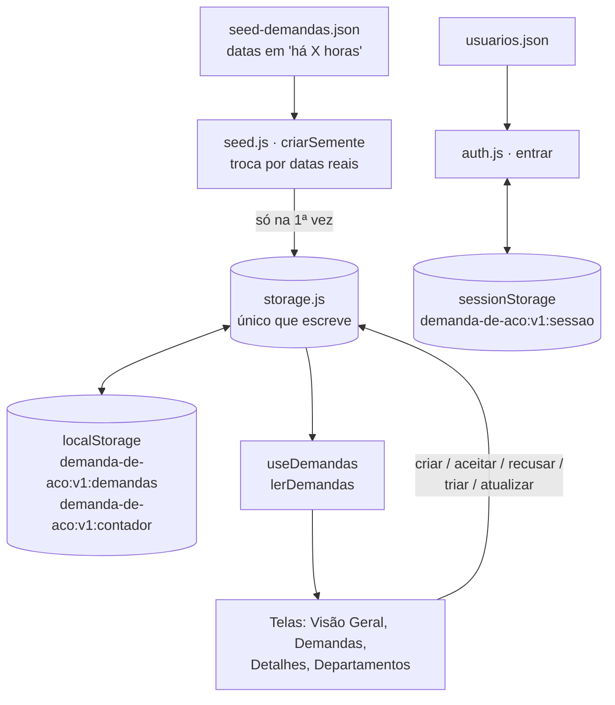

# 12 — Fluxo de dados e JSON

> Termos: **JSON** = arquivo de dados em texto. **Seed (semente)** = dados de exemplo da primeira vez. **localStorage** = "gaveta" do navegador que guarda texto mesmo depois de fechar. **sessionStorage** = gaveta que se esvazia ao fechar a aba.

## 1. Os arquivos JSON (`src/data/`)
| Arquivo | O que contém | Quem usa |
|---|---|---|
| `seed-demandas.json` | **13 demandas** de exemplo (`id`, `titulo`, `descricao`, `tipo`, `origem`, `destino`, `prioridade`, `status`, `solicitante`, `criadaHaHoras`, `historico`; algumas têm `aceitaHaHoras` e outros "há X horas") | `src/services/seed.js` |
| `usuarios.json` | os 5 logins: `usuario`, `senha`, `nome`, `perfil`, `departamento` | `src/services/auth.js` |
| `departamentos.json` | os 4 setores: `id`, `nome`, `descricao`, `icone`, `cor`, `tiposAtendimento` | `Sidebar.jsx`, `Demandas.jsx`, `Departamentos.jsx`, `NovaDemanda.jsx`, `AtualizarDemanda.jsx`, `TriagemDemanda.jsx`, `VisaoGeral.jsx`, `src/domain/setores.js` |
| `demandas.json` | dados antigos das telas dos colegas | **nenhum arquivo usa** (desde o Bloco 2A) |
| `VisaoGeral.json` | números antigos, digitados à mão, da Visão Geral | **nenhum arquivo usa** |

## 2. O caminho dos dados

1. `seed-demandas.json` guarda as datas como "há X horas".
2. `criarSemente` (`src/services/seed.js`) troca cada "há X horas" por uma data real, **a partir de agora**.
3. Só na primeira carga (a chave não existe), `storage.js` grava a semente no `localStorage`, na chave `demanda-de-aco:v1:demandas`.
4. Depois disso, **só o `storage.js` lê e escreve** no `localStorage`. Nenhuma tela mexe direto.
5. As telas leem pelo hook `useDemandas`, que chama `lerDemandas`.
6. Para mudar algo, a tela chama `criarDemanda` ou `atualizarDemanda`, que confere a regra e grava.
7. O login lê `usuarios.json` (`auth.js`) e guarda a sessão no `sessionStorage`, em `demanda-de-aco:v1:sessao`.

## 3. Quem lê e quem escreve
| Passo | Lê | Escreve |
|---|---|---|
| Primeira carga | `seed-demandas.json` (via `criarSemente`) | `storage.js` → `demanda-de-aco:v1:demandas` |
| Abrir qualquer tela | `useDemandas` → `lerDemandas` → `carregarDemandas` | — |
| Criar demanda (Nova Demanda) | lista atual + contador | `criarDemanda`: a lista com a demanda nova e o contador (`demanda-de-aco:v1:contador`) |
| Aceitar, recusar, triar, atualizar | `atualizarDemanda` relê a lista **na hora** | a lista inteira, com a demanda alterada pela regra (`aceitarDemanda`, `recusarDemanda`, `redirecionarDemanda`, `marcarNaoAplicavel`, `cancelarDemanda`, `salvarAtualizacao`) |
| Entrar / Sair | `usuarios.json` | `auth.js` grava ou apaga `demanda-de-aco:v1:sessao` |
| Resetar dados | — | `resetarDados` **apaga** as chaves de demandas e de contador |

- **Se a regra recusar** (ex.: setor sem permissão), `atualizarDemanda` não grava nada.
- **Toda ação acrescenta um item ao `historico`** (RN22), com autor, perfil, data e texto.

## 4. Como nasce o número DM-xxxx
`proximoId` (dentro de `storage.js`) pega o **maior** entre o contador salvo e o maior número que existe na lista, soma 1 e grava o contador. Por isso, depois de um reset, a primeira demanda nova é a **DM-2014** (a semente vai até a DM-2013).

## 5. Exemplo: "criei a DM-2015, o que mudou onde?"
1. `user03` preenche a Nova Demanda e clica em "Criar Nova Demanda".
2. `validarNovaDemanda` confere os campos; `montarNovaDemanda` monta a demanda: Pendente de aceite, prioridade "Não definida", origem `administrativo`, item "Demanda criada." no histórico.
3. `criarDemanda`:
   1. espera um pouco (simula a rede);
   2. lê a lista;
   3. calcula o número: o contador estava em 2014, então sai DM-2015;
   4. grava o contador `2015`;
   5. grava a lista com a DM-2015 no fim.
4. **No `localStorage`:** a chave `demanda-de-aco:v1:demandas` ganhou a DM-2015 e `demanda-de-aco:v1:contador` virou `2015`.
5. **No `seed-demandas.json`:** **nada mudou**.
6. A tela mostra o pop-up "Demanda enviada" com o número.

## 6. "Resetar dados"
- **Apaga:** `demanda-de-aco:v1:demandas` e `demanda-de-aco:v1:contador`.
- **Não apaga:** a sessão (`sessionStorage`) nem os arquivos JSON.
- A próxima leitura recria a semente com **datas novas, relativas a agora**. Por isso os prazos (a expirar, vencidas, atrasadas) **dependem da hora do reset**: uma demanda "aceita há 40 h, prazo de 48 h" vence 8 h depois do reset.
- Na tela de login há confirmação antes de apagar (`resetarComConfirmacao`, em `src/services/reset.js`).

## 7. Se o `localStorage` estiver corrompido
`carregarDemandas` tenta ler o JSON; se o texto estiver quebrado ou não for uma lista de demandas, devolve o erro `corrompido` e **não apaga nada sozinho**. A tela mostra a mensagem (`ErroDados`, em `src/components/EstadoDados.jsx`) com o botão "Resetar dados"; quem decide é a pessoa.

## 8. Aviso honesto
As senhas estão em **texto simples** em `usuarios.json` e vão junto no código entregue ao navegador. Isso só é aceitável porque é **simulação** (o enunciado proíbe back-end). Num sistema real: servidor, banco de dados, senha guardada como hash e login com token (DOCUMENTACAO, seção 20).
