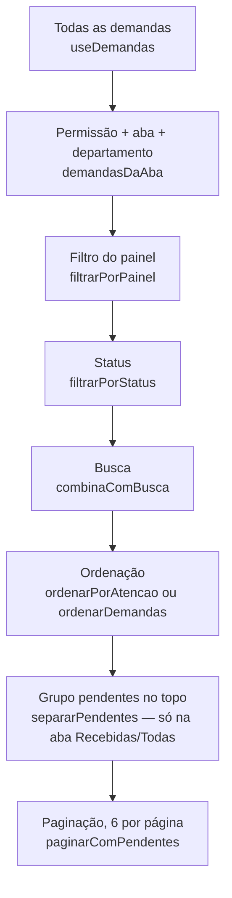

# 14 — Barras de filtro, busca, ordenação e paginação

> Termo: **estado** = um valor que a tela lembra (ver o arquivo 11). Cada controle abaixo guarda o que a pessoa escolheu num estado, e a lista é recalculada sempre que ele muda.

## 1. Todos os controles
| Controle | Tela | Estado (onde) | Função que filtra/ordena |
|---|---|---|---|
| Busca "Pesquisar demanda..." | Visão Geral (`VisaoGeralSearchBar.jsx`) | `busca` em `VisaoGeral.jsx` | `combinaComBusca` (`src/domain/listas.js`) |
| Busca "Buscar por título, ID ou solicitante..." | Demandas | `searchTerm` em `Demandas.jsx` | `combinaComBusca` (a mesma da Visão Geral) |
| Busca "Buscar setor por nome ou descrição..." | Departamentos | `termoBusca` em `Departamentos.jsx` | filtro dentro de `Departamentos.jsx` (nome + descrição do setor) |
| Select "Setor:" (só gerência) | Visão Geral | `setor` em `VisaoGeral.jsx` | filtro com `setorResponsavel` dentro de `VisaoGeral.jsx` |
| Select "Departamento:" | Demandas | `setor` em `Demandas.jsx` (para um setor, fica travado no próprio) | `demandasDaAba` (`listas.js`) |
| Select "Status:" (Todos + 7 status) | Demandas | `statusFiltro` | `filtrarPorStatus` |
| Select "Ordenar por:" | Demandas | `sortBy` (começa em `atencao`) | `ordenarPorAtencao` ou `ordenarDemandas` |
| Abas Recebidas/Solicitadas (gerência: Todas/Solicitadas por mim) | Demandas | `aba` | `abasDoPerfil` + `demandasDaAba` |
| Abas Todas · Pendentes · Alta prioridade · Em triagem · Concluídas | Visão Geral (`VisaoGeralFilterTabs.jsx`) | `filtroAtivo` | `filtrarVisaoGeral` |
| Filtro vindo de um card | Demandas | `filtroPainel` | `filtrarPorPainel` (arquivo 15) |
| Paginação ‹ › (6 por página) | Demandas | `currentPage`; `ITEMS_PER_PAGE = 6` | `paginarComPendentes` |
| Grupo "Pendentes de aceite" no topo | Demandas, aba Recebidas/Todas | — | `separarPendentes` + `paginarComPendentes` |

**As 6 opções de "Ordenar por":**
1. Atenção primeiro (`atencao`, o padrão): triagem e pendentes primeiro, a mais antiga antes; depois prioridade e data.
2. Prioridade e data (`padrao`): Urgente → Alta → Média → Baixa → Não definida; empate pela mais recente; depois pelo título (`compararDemandas`).
3. Mais recentes (`recentes`).
4. Mais antigas (`antigas`).
5. Maior prioridade (`maior-prioridade`).
6. Menor prioridade (`menor-prioridade`).

## 2. O que a busca procura e por quê
`combinaComBusca` procura em **ID, título, descrição, tipo, solicitante e setor de origem**, sem diferença de maiúscula ou acento ("hidraulica" acha "Hidráulica").

São só esses campos porque **todos aparecem também para quem só abriu a demanda** (resumo da RN03). Se a busca procurasse em prioridade ou histórico, quem só abriu poderia "descobrir" uma informação interna (RN02) pelo resultado. Há um teste para isso: "não procura em campos internos (prioridade, histórico, destino)".

## 3. Em que ordem a tela Demandas aplica tudo

1. **Permissão, aba e departamento juntos** (`demandasDaAba`): só o que o perfil pode ver (`podeVer`), da aba escolhida e, para a gerência, do departamento escolhido.
2. **Filtro do painel** (`filtrarPorPainel`), se veio de um card da Visão Geral.
3. **Status** (`filtrarPorStatus`).
4. **Busca** (`combinaComBusca`).
5. **Ordenação:** "Atenção primeiro" usa `ordenarPorAtencao`; as outras opções usam `ordenarDemandas`.
6. **Grupo de pendentes** no topo (`separarPendentes`), só na aba Recebidas (para a gerência, "Todas").
7. **Paginação** (`paginarComPendentes`): 6 por página, o grupo primeiro, sem repetir nada.

*Por que a permissão vem primeiro:* assim nenhum filtro consegue mostrar demanda de outro setor (RN02).

**Na Visão Geral** a ordem é parecida, mas mais curta:
1. base = o que o perfil pode ver (e, para a gerência, o setor escolhido);
2. aba (`filtrarVisaoGeral`);
3. busca;
4. ordem "atenção primeiro, depois recentes".

Lá não há paginação.

## 4. Exemplo: "busquei 'lucas', status Em andamento, ordenando por mais antigas"
Perfil `admin`, aba "Todas":
1. `demandasDaAba` → todas as 13 (a gerência vê tudo).
2. Sem filtro do painel → continuam 13.
3. `filtrarPorStatus(…, 'Em andamento')` → só as que estão Em andamento.
4. `combinaComBusca(demanda, 'lucas')` → só as que têm "lucas" em ID, título, descrição, tipo, solicitante ou origem. No seed, "Lucas Ribeiro" é o solicitante da DM-2002, que está **Pendente de aceite**, então o resultado tende a ser **0**: "Nenhuma demanda encontrada". Se antes alguém aceitou a DM-2002, ela aparece.
5. `ordenarDemandas(…, 'antigas')` → da mais antiga para a mais nova (pela criação).
6. `separarPendentes` → nenhuma pendente (o filtro é Em andamento).
7. `paginarComPendentes` → página 1 com até 6; o texto mostra "Exibindo N de N demandas".

## 5. Onde aparece na tela
- O resultado é anunciado: "Exibindo X de Y demandas" (`aria-live` em `Demandas.jsx`) e "N demandas exibidas" (`role="status"` em `VisaoGeralDemandList.jsx`).
- Lista vazia: "Nenhuma demanda encontrada" + "Tente outra busca, outro status ou outro departamento."

## 6. Limitações
- **A14:** a busca de Demandas tem no máximo 430 px de largura.
- **A17:** o filtro do card continua ao trocar de aba (arquivo 15).
- A busca de Departamentos procura só no nome e na descrição dos **setores**, não em demandas.
