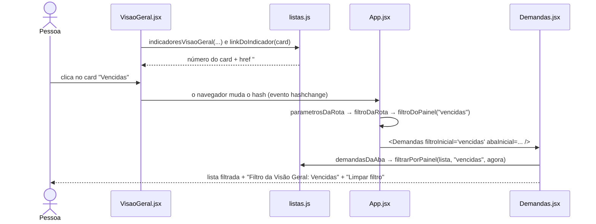

# 15 — O filtro da Visão Geral para Demandas e os destaques

## 1. A técnica, passo a passo
**Ideia:** o card da Visão Geral é um **link**. O link leva, no próprio endereço, qual filtro aplicar. A tela Demandas lê o endereço e aplica o filtro.


1. A Visão Geral calcula os cards com `indicadoresVisaoGeral` (`src/domain/listas.js`). Cada card tem um `status` (ex.: Em triagem) ou um `filtro` (ex.: `vencidas`).
2. `linkDoIndicador` transforma o card num endereço:
   - por status: `#demandas?status=em-triagem` (via `linkDaLista`);
   - por filtro: `#demandas?filtro=vencidas`;
   - "Solicitadas por mim em aberto": `#demandas?filtro=solicitadas-abertas&aba=solicitadas`;
   - gerência com setor escolhido: `#demandas/eletrica?filtro=…`.
3. O card é desenhado como link `<a>` com "Ver na lista" (`VisaoGeralStatsCards.jsx`). Os links da faixa "Precisa de atenção" usam `linkDaLista`.
4. Ao clicar, o hash muda. `App.jsx` percebe (`hashchange`) e lê os parâmetros:
   - `parametrosDaRota` separa o que vem depois do `?`;
   - `statusDaRota`, `filtroDaRota` e `abaDaRota` validam;
   - um filtro desconhecido vira "sem filtro" (`filtroDoPainel`).
5. `App.jsx` passa os valores para `Demandas` (`statusInicial`, `filtroInicial`, `abaInicial`).
6. `Demandas.jsx` aplica, nesta ordem:
   1. permissão (`demandasDaAba`);
   2. o filtro do card (`filtrarPorPainel`, que usa `FILTROS_DO_PAINEL`);
   3. o status;
   4. a busca;
   5. a ordenação;
   6. a paginação.
7. A tela mostra "**Filtro da Visão Geral:** Vencidas" e o botão **"Limpar filtro"**, que zera o filtro.

**Por que pela URL (endereço)?**
- Nenhuma "memória global" é necessária: o endereço carrega a informação.
- O botão Voltar do navegador volta para a Visão Geral.
- O link pode ser copiado ou aberto de novo.
- É o mesmo jeito que o app já usa para trocar de tela (hash).

*Observação honesta:* "Limpar filtro" limpa a lista, mas **não tira** o `?filtro=` do endereço. Se recarregar a página, o filtro volta.

## 2. Por que o número do card bate com a lista
O card e a lista usam **o mesmo teste**. Exemplo real:
```js
// src/domain/listas.js (≈ linha 172)
export const FILTROS_DO_PAINEL = {
  abertas: { rotulo: 'Abertas', teste: (d) => !estaFinal(d.status) },
  'recebidas-abertas': { rotulo: 'Recebidas abertas', teste: prazoCorrendo },
  'a-expirar': { rotulo: 'A expirar', teste: (d, agora) => aExpirar(d, agora) },
  vencidas: { rotulo: 'Vencidas', teste: (d, agora) => vencida(d, agora) },
  aguardando: { rotulo: 'Aguardando > 7 dias', teste: (d, agora) => aguardandoMuito(d, agora) },
  ...
```
`indicadorDoPainel` **conta** com `teste`; `filtrarPorPainel` **filtra** com o mesmo `teste`. Há testes automáticos que conferem, card a card, que o número bate com a lista ("gerência: Abertas, A expirar, Vencidas e Aguardando batem com a lista filtrada").

## 3. Os destaques, um por um
| Destaque | Regra de negócio | Função que calcula | Quem desenha | CSS |
|---|---|---|---|---|
| Faixa **"Precisa de atenção"** ("N aguardando triagem", "N pendentes de aceite") | demandas paradas esperando alguém (propostas 13 e 14) | `avisoDeAtencao` (`listas.js`) | `VisaoGeral.jsx` (seção `vg-aviso`) | `.vg-aviso` em `VisaoGeral.css` |
| Card **"Pendentes de aceite"** + chip **"48 h para aceitar"** | RN09 (texto atual 72 h; **proposta em uso: 48 h**) | contagem em `indicadoresVisaoGeral`; o texto vem de `SELO_ACEITE`, montado com `LIMITE_ACEITE_HORAS` (`atencao.js`) | `VisaoGeralStatsCards.jsx` | `.badge--ambar` |
| Card **"A expirar"** + chip **"25% do prazo"** | RN15: resta 25% do prazo ou menos. O prazo é o da RN13, contado do aceite: Urgente 24 h, Alta 48 h, **Média 72 h**, Baixa 7 dias | `aExpirar` (`src/domain/prazos.js`) | `VisaoGeralStatsCards.jsx` | `.badge--ambar` |
| Card **"Vencidas"** + chip **"Prazo passou"** | RN15: passou do prazo | `vencida` (`prazos.js`) | `VisaoGeralStatsCards.jsx` | `.badge--vermelho` |
| Card **"Aguardando > 7 dias"** | RN16 | `aguardandoMuito` (`prazos.js`) | `VisaoGeralStatsCards.jsx` | `.stat-card` (sem chip) |
| Selo **"Aguardando aceite há X horas"** / **"Atrasada para aceite"** | RN09 (48 h; 24 h depois de redirecionada, RN18) | `seloDeAtencao`, `formatarTempoParado`, `estaAtrasada`, `prazoDeAceite` (`atencao.js`) | `DemandCard` em `Demandas.jsx`; `VisaoGeralDemandCard.jsx` | `.attention-tag` / `.attention-tag--late` (`App.css`); `.badge--ambar` / `.badge--vermelho` + `.demand-card__selo` (`VisaoGeral.css`) |
| Selo **"Em triagem · parada há X"** / **"Atrasada para triagem"** | RN17 (texto atual 72 h; **proposta em uso: 24 h**, contadas da recusa) | `seloDeAtencao` + `LIMITE_TRIAGEM_HORAS` (`atencao.js`) | os mesmos | os mesmos |

- **Quem vê os selos:** aceite, o setor executor e a gerência; triagem, só a gerência; quem só abriu não vê tempo parado (RN03).
- O "agora" é fixado quando a tela abre (`useState(() => new Date())`), por isso os números não mudam enquanto a tela está aberta, só ao reabrir.

## 4. Limitação real: achado 17
- **O que acontece:** vindo do card "Recebidas abertas" (perfil de setor), se trocar para a aba "Solicitadas", o aviso "Filtro da Visão Geral: Recebidas abertas" continua e filtra a outra aba.
- **Causa:** `trocarAba` em `Demandas.jsx` muda a aba, mas não limpa `filtroPainel`.
- **Na demo:**
  - depois de clicar num card, **não troque de aba**;
  - se precisar trocar, clique antes em **"Limpar filtro"**;
  - para mostrar a aba Solicitadas, use o card "Solicitadas por mim em aberto", que já abre na aba certa.
