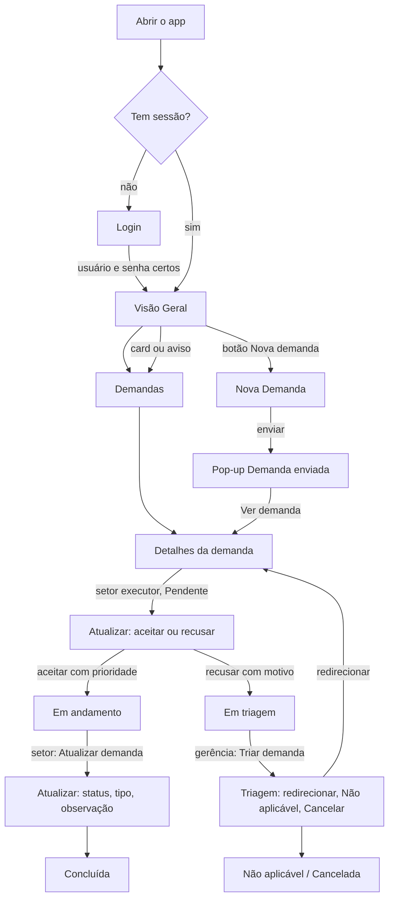

# 16 — Caminho do usuário e navegação

## 1. Caminho completo

1. Ao abrir o app, sem sessão, aparece o Login. Com usuário e senha certos, a pessoa vai para a Visão Geral.
2. Da Visão Geral, ela vai a Demandas pelo menu, por um card ou pelo aviso.
3. Clicando num card de demanda, abre os Detalhes.
4. O setor executor, numa demanda Pendente, clica em "Aceitar ou recusar":
   - aceitar (escolhendo a prioridade) leva a Em andamento;
   - recusar (com motivo) leva a Em triagem.
5. A gerência, numa demanda Em triagem, clica em "Triar demanda": redirecionar (volta a Pendente no novo setor), Não aplicável ou Cancelar.
6. O setor, numa demanda Em andamento ou Aguardando, clica em "Atualizar demanda" e chega a Concluída.
7. Pelo botão "Nova demanda", envia uma demanda → pop-up "Demanda enviada" → "Ver demanda" abre os Detalhes.

## 2. Opções de navegação
| Opção | Onde | O que faz |
|---|---|---|
| Menu: Nova demanda, Visão geral, Demandas, Departamentos | `Sidebar.jsx` (igual para todos os perfis) | links `#nova-demanda`, `#visao-geral`, `#demandas`, `#departamentos` |
| Marca "Demanda de aço" | `Sidebar.jsx` | volta à Visão Geral |
| Botão "Nova demanda" | `VisaoGeralHeader.jsx` | abre `#nova-demanda` |
| Sair | `Sidebar.jsx` (`onSair`) | apaga a sessão e volta ao login |
| "Resetar dados" | `Login.jsx` (com confirmação) e mensagem de dados com problema (`ErroDados`) | volta aos dados de exemplo |
| "Acessar setor" | `Departamentos.jsx` | abre `#demandas/<setor>` |
| Voltar do navegador | — | volta ao endereço anterior; depois de Sair, o app usa `location.replace` e não reabre tela protegida |
| "Ir para o conteúdo" | `App.jsx` | leva o foco ao título da tela (para teclado) |

## 3. O que cada perfil vê de diferente
| | `admin` (Gerenciamento) | `user01` TI · `user02` Hidráulica · `user03` Administrativo · `user04` Elétrica |
|---|---|---|
| Título do painel | "Painel de Gerenciamento" | **o mesmo** "Painel de Gerenciamento" (texto dos colegas, mantido) |
| Cards da Visão Geral | Abertas, Pendentes de aceite, Em triagem, A expirar, Vencidas, Aguardando > 7 dias, Concluídas | Recebidas abertas, Pendentes de aceite, A expirar, Resolvidas, Solicitadas por mim em aberto |
| Select "Setor:" na Visão Geral | sim | não |
| Abas em Demandas | Todas · Solicitadas por mim | Recebidas · Solicitadas |
| Select "Departamento" em Demandas | escolhe qualquer um | travado no próprio setor |
| Departamentos | os 4 cards | só o card do próprio setor |
| Ações | "Triar demanda" (em triagem) | "Aceitar ou recusar" (pendente que recebeu); "Atualizar demanda" (em andamento/aguardando que recebeu) |
| Demanda que só abriu | — | só o resumo, sem botões |

## 4. Endereços (hash) válidos
| Endereço | Tela |
|---|---|
| `#login` | Login |
| `#visao-geral` | Visão Geral |
| `#demandas` | Demandas; aceita `/<setor>` e `?status=`, `?filtro=`, `&aba=` |
| `#departamentos` | Departamentos |
| `#nova-demanda` | Nova Demanda |
| `#demanda/DM-2003` | Detalhes da DM-2003 |
| `#demanda/DM-2003/editar` | Atualizar (ou Triagem, para a gerência em triagem) |

- **Endereço inválido** (ex.: `#xyz`): `getPageFromHash` devolve `demandas`, e abre a tela Demandas.
- **Sem login:** qualquer endereço vai para `#login`.
- **Demanda que não existe ou sem permissão:** "Demanda não encontrada ou sem permissão." (RN04).

## 5. Máquina de estados (status)
```mermaid
stateDiagram-v2
  [*] --> PendenteDeAceite: criar
  PendenteDeAceite --> EmAndamento: setor aceita (prioridade)
  PendenteDeAceite --> EmTriagem: setor recusa (motivo)
  PendenteDeAceite --> Cancelada: gerência (justificativa)*
  EmAndamento --> Aguardando: setor
  Aguardando --> EmAndamento: setor
  EmAndamento --> Concluida: setor
  Aguardando --> Concluida: setor
  EmAndamento --> EmTriagem: setor devolve*
  Aguardando --> EmTriagem: setor devolve*
  EmAndamento --> Cancelada: gerência*
  Aguardando --> Cancelada: gerência*
  EmTriagem --> PendenteDeAceite: gerência redireciona (setor, tipo, justificativa)
  EmTriagem --> NaoAplicavel: gerência (justificativa)
  EmTriagem --> Cancelada: gerência (justificativa)
  Concluida --> [*]
  NaoAplicavel --> [*]
  Cancelada --> [*]
```
1. A demanda nasce **Pendente de aceite**.
2. **Pendente:**
   - o setor aceita, com prioridade → **Em andamento**;
   - o setor recusa, com motivo → **Em triagem**;
   - a gerência pode cancelar\*.
3. **Em andamento ↔ Aguardando:** o setor alterna entre os dois. De qualquer um, o setor conclui → **Concluída**. De qualquer um, o setor poderia devolver à triagem\* e a gerência poderia cancelar\*.
4. **Em triagem:** só a gerência age.
   - redirecionar → **Pendente de aceite**, no novo setor;
   - Não aplicável;
   - Cancelar.
5. **Concluída, Não aplicável e Cancelada são finais** (RN20, `estaFinal`). Nenhum perfil tem botão de ação, e a tela de edição mostra "Esta demanda foi finalizada e não pode mais ser alterada."

\* **Previsto nas regras** (`TRANSICOES` em `src/domain/status.js`; cancelar em `cancelarDemanda`), mas **sem botão na tela**: a tela só oferece cancelar em triagem, e "devolver à triagem" não tem tela.
